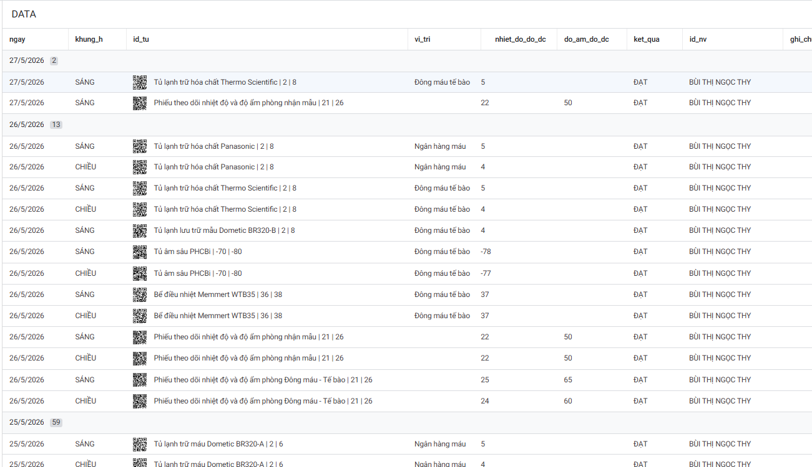

# QUY TRÌNH THEO DÕI VÀ QUẢN LÝ DỮ LIỆU NHIỆT ĐỘ

---

### 1. Người dùng điền dữ liệu vào Web
* Truy cập biểu mẫu trực tuyến để nhập thông tin theo dõi nhiệt độ và độ ẩm:
  - **Đường dẫn:** https://quangh161t25.github.io/nhi_dong_1/index.html

---

### 2. Thu thập và tự động đổ dữ liệu về AppSheet
* Dữ liệu sau khi người dùng gửi sẽ được tự động đồng bộ về hệ thống AppSheet để lưu trữ và quản lý tập trung.

---

### 3. Xem và kiểm tra dữ liệu hằng ngày
* Hệ thống hiển thị chi tiết lịch sử ghi nhận nhiệt độ theo từng ngày, từng thiết bị và phòng ban.

---

### 4. Xem biểu đồ trực quan hóa dữ liệu
* Hỗ trợ theo dõi diễn biến nhiệt độ trực quan qua biểu đồ:
  - **Thao tác:** Bấm vào nút/biểu tượng để mở biểu đồ:
  
  

* **Giao diện hiển thị biểu đồ và báo cáo:**

---

### 5. Kế hoạch chuyển đổi sang Email Bệnh viện
* [ ] Tạo tài khoản GitHub liên kết với Email bệnh viện.  nhidong1.github
* [ ] Tạo API từ Email bệnh viện. nhidong1
* [ ] Đẩy mã nguồn (source code) lên repository mới.
* [ ] Sao chép (Copy) và phân quyền lại ứng dụng AppSheet.

---

### 6. Định hướng phát triển tiếp theo
* Phát triển và mở rộng thành hệ thống Web App chuyên sâu phục vụ quản lý, giám sát nhiệt độ tự động và cảnh báo tức thời.

