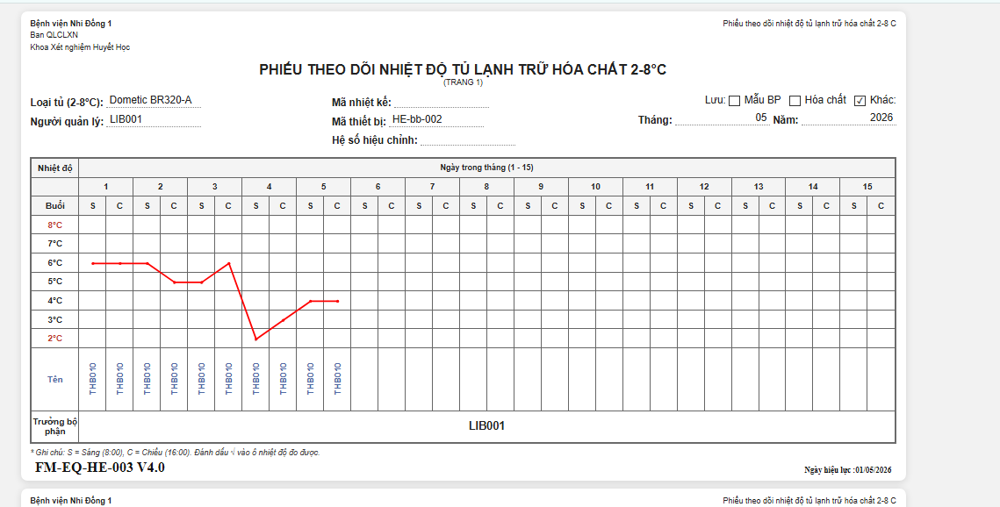

1 người dùng sẽ điền dữ liệu và web  
https://quangh161t25.github.io/nhi_dong_1/index.html

2 thu thập dữ liệu sẽ  đổ dữ liệu về appsheet

3 có xem đc dữ liệu hằng ngày.

4 có biểu đồ để nhìn

5 chuyển đổi sang mail của bv.
    - tạo 1 git mail bệnh viên
    - tạo  api từ mail bẹnh viện
    - add code lên
    - copy appsheet

6 phát triển thêm sẽ làm web 

